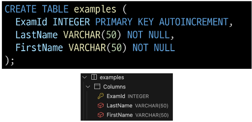
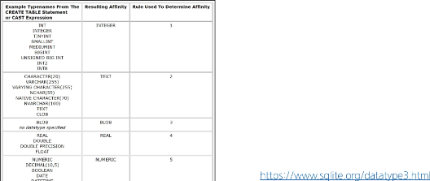

# Create a table

## CREATE TABLE

### CREATE TABLE statement

- 테이블 생성

### CREATE TABLE syntax

- 각 필드에 적용할 데이터 타입 작성

- 테이블 및 필등 대한 제약조건(constraints) 작성

### CREATE TABLE 활용

- examples 테이블 생성 및 확인

### PRAGMA

- 테이블 schema(구조) 확인

- "cid"
  - Column ID를 의미하며 각 컬럼의 고유한 식별자를 나타내는 정수 값
  - 직접 사용하지 않으며 PRAGMA 명령과 같은 메타데이터 조회에서 출력 값으로 활용됨

### 데이터 타입

### 제약 조건

### AUTOINCREMENT 키워드

### SQLite 데이터 타입

### Constraints (제약 조건)

- 테이블의 필드에 적용되는 규칙 또는 제한 사항

- > 데이터의 무결성을 유지하고 데이터베이스의 일관성을 보장

### 대표 제약 조건 3가지

- PRIMARY KEY

  - 해당 필드를 기본 키로 지정
  - INTEGER 타입에만 적용되며 INT, BIGNT 등과 같은 다른 정수 유형은 적용되지 않음

- NOT NULL

  - 해당 필드에 NULL 값을 허용하지 않도록 지정

- FOREIGN KEY
  - 다른 테이블과의 외래 키 관계를 정의

### AUTOINCREMENT keyword

- 자동으로 고유한 정수 값을 생성하고 할당하는 필드 속성

### AUTOINCREMENT 특징

- 필드의 자동 증가를 나타내는 특수한 키워드
- 주로 primary key 필드에 적용
- INTEGER PRIMARY KEY AUTOINCREMENT가 작성된 필드는 항상 새로운 레코드에 대해 이전 최대 값보다 큰 값을 할당
- 삭제된 값은 무시되며 재사용할 수 없게 됨

# Modifying table fields

## ALTER TABLE

### ALTER TABLE statement

- 테이블 및 필드 조작

### ALTER TABLE 역할

### 1. ALTER TABLE ADD COLUMN syntax

- ADD COLUMN 키워드 이후 추가하고자 하는 새 필드 이름과 데이터 타입 및 제약 조건 작성

- 단, 추가하고자 하는 필드에 NOT NULL 제약조건이 있을 경우 NULL이 아닌 기본 값 설정 필요

### ALTER TABLE ADD COLUMN 활용 1

- examples 테이블에 다음 조건에 맞는 Country 필드 추가

### ALTER TABLE ADD COLUMN 활용 2

- examples 테이블에 다음 조건에 맞는 Age, Address 필드 추가

### 2. ALTER TABLE RENAME COLUMN syntax

- RENAME COLUMN 키워드 뒤에 이름을 바꾸려는 필드의 이름을 지정하고 TO 키워드 뒤에 새 이름을 지정

### ALTER TABLE RENAME COLUMN 활용 1

- example 테이블 Address 필드의이름을 PostCode로 변경

### 3. ALTER TABLE DROP COLUMN syntax

- DROP COLUMN 키워드 위에 삭제 할 필드 이름 지정

### ALTER TABLE DROP COLUMN 활용

- examples 테이블의 PostCode 필드를 삭제

### 4. ALTER TABLE RENAME TO syntax

- RENAME TO 키워드 뒤에 새로운 테이블 이름 지정

### ALTER TABLE RENAME TO 활용

- examples 테이블 이름을 new_examples로 변경

# Delete a table

## DROP TABLE

### DROP TABLE statement

- 테이블 삭제

### DROP TABLE syntax

- DROP TABLE statement 이후 삭제할 테이블 이름 작성

### DROP TABLE 활용

- new_examples 테이블 삭제

# Insert data

## INSERT

### 사전 준비

- 실습 테이블 생성

### INSERT statement

- 테이블 레코드 삽입

### INSERT syntax

- INSERT INTO 절 다음에 테이블 이름과 괄호 안에 필드 목록 작성

- VALUES 키워드 다음 괄호 안에 해당 필드에 삽입할 값 목록 작성

### INSERT 활용 1

- articles 테이블에 다음과 같은 데이터 입력

### INSERT 활용 2

- articles 테이블에 다음과 같은 데이터 추가 입력

### INSERT 활용 3

- DATE 함수를 사용해 articles 테이블에 다음과 같은 데이터 추가 입력

# Update datea

## UPDATE

### UPDATE statement

- 테이블 레코드 수정

### UPDATE syntax

- SET 절 다음에 수정 할 필드와 새 값을 지정
- WHERE 절에서 수정 할 레코드를 지정하는 조건 작성
- WHERE 절을 작성하지 않으면 모든 레코드를 수정

### UPDATE 활용 1

- articles 테이블 1번 레코드의 title 필드 값을 'update Title'로 변경

### UPDATE 활용 2

- articles 테이블 2번 레코드의 title, content 필드 값을 각각 'update Title', 'update Content'로 변경

# Delete Data

## DELETE

### DELETE statement

- 테이블 레코드 삭제

### DELETE syntax

- DELETE FROM 절 다음에 테이블 이름 작성

- WHERE 절에서 삭제할 레코드를 지정하는 조건 작성

- WHERE 절을 작성하지 않으면 모든 레코드를 삭제

### DELETE 활용 1

- articles 테이블의 1번 레코드 삭제

### DELETE 활용 2

- articles 테이블에서 작성일이 오래된 순으로 레코드 2개 삭제

# Join

### 관계

- 여러 테이블 간의 (논리적) 연결

### 관계의 필요성

- 커뮤니티 게시판에 필요한 데이터 생각해보기

- '하석주'가 작성한 모든 게시글을 조회하기

- 어떤 문제점이 있을까?

  - 동명이인이 있다면 혹은 특정 데이터가 수정된다면?

  

- 테이블을 나누어서 분류하자

- 각 게시글은 누가 작성했는지 알 수 있을까?

  - 작성자들의 역할은 무엇일까?

- articles와 users 테이블에 각각 userId, roleId 외래 키 필드 작성

- 관리자인 사람만 보고 싶다면 ? -> roleId가 1인 데이터 조회
- 하석주라는 사람이 권미숙으로 개명한다면 ? -> users에서 한번만 병경하면 자동으로 모두 변경

### JOIN이 필요한 순간

- 테이블을 분리하면 데이터 관리는 용이해질 수 있으나 출력시에는 문제가 있음

- 테이블 한 개 만을 출력할 수 밖에 없어 다른 테이블과 결합하여 출력하는 것이 필요해짐

- > 이때 사용하는 것이 'JOIN'

# Joining tables

## JOIN

### JOIN clause

- 둘 이상의 테이블에서 데이터를 검색하는 방법

### JOIN 종류

1. INNER JOIN
2. LEFT JOIN

### 사전 준비

- users 및 articles 테이블 생성

- 각 테이블에 실습 데이터 입력

## INNER JOIN

### INNER JOIN clause

- 두 테이블에서 값이 일치하는 레코드에 대해서만 결과를 반환

### INNER JOIN syntax

- FROM 절 이후 메인 테이블 지정 (table_a)

- INNER JOIN 절 이후 메인 테이블과 조인할 테이블을 지정 (table_b)

- ON 키워드 이후 조인 조건을 작성

- 조인 조건은 table_a와 table_b 간의 레코드를 일치시키는 규칙을 지정

### INNER JOIN 예시

- 작성자가 있는 (존재하는 회원) 모든 게시글을 작성자 정보와 함께 조회

### INNER JOIN 활용 1

- 1번 회원(하석주)가 작성한 모든 게시글의 제목과 작성자명을 조회

## LEFT JOIN

### LEFT JOIN clause

- 오른쪽 테이블의 일치하는 레코드와 함께 왼쪽 테이블의 모든 레코드 반환

### LEFT JOIN syntax

- FROM절 이후 왼쪽 테이블 지정 (table_a)

- LEFT JOIN절 이후 오른쪽 테이블 지정 (table_b)

- ON 키워드 이후 조인 조건을 작성
  - 왼쪽 테이블의 각 레코드를 오른쪽 테이블의 모든 레코드와 일치시킴

### LEFT JOIN 예시

- 모든 게시글을 작성자 정보와 함께 조회

### LEFT JOIN 특징

- 왼쪽 테이블의 모든 레코드를 표기

- 오른쪽 테이블과 매칭되는 레코드가 없으면 NULL을 표시

### LEFT JOIN 활용 1

- 게시글을 작성한 이력이 없는 회원 정보 조회

# <참고>

## 타입 선호도(Type Affinity)

- 컬럼에 데이터 타입이 명시적으로 지정되지 않았거나 지원하지 않을 때 SQLite가 자동으로 데이터 타입을 추론하는 것

### SQLite 타입 선호도의 목적

1. 유연한 데이터 타입 지원

- 데이터 타입을 명시적으로 지정하지 않고도 데이터를 저장하고 조회할 수 있음
- 컬럼에 저장되는 값의 특성을 기반으로 데이터 타입을 유추

2. 간편한 데이터 처리

- INTEGER Type Affinity를 가진 열에 문자열 데이터를 저장해도 SQLite는 자동으로 숫자로 변환하여 처리

3. SQL 호환성

- 다른 데이터베이스 시스템과 호환성을 유지

## NOT NULL

### 반드시 NOT NULL 제약을 사용해야 할까?

- "NO"
- 하지만 데이터베이스를 사용하는 프로그램에 따라 NULL을 저장할 필요가 없는 경우가 많으므로 대부분 NOT NULL을 정의
- "값이 없다" 라는 표현을 테이블에 기록하는 것은 '0'이나 '빈 문자열'등을 사용하는 것으로 대체하는 것을 권장

## 날짜와 시간

### SQLite의 날짜와 시간

- SQLite에는 날짜 및/또는 시간을 저장하기 위한 별도 데이터 타입이 없음

- 대신 날짜 및 시간에 대한 함수를 사용해 표기 형식에 따라 TEXT, REAL, INTEGER 값으로 저장

- https://www.sqlite.org/datatype3.html
