# Many to many relationships

## 개요

### Many to many relationships (N:M or M:N)

- 한 테이블의 0개 이상의 레코드가 다른 테이블의 0개 이상의 레코드와 관련된 경우
    - > 양쪽 모두에서 N:1 관계를 가짐

### M:N 관계의 역할과 필요성 이해하기

- '병원 진료 시스템 모델 관계'를 만들며 M:N 관계의 역할과 필요성 이해하기

- 환자와 의사 2개의 모델을 사용하여 모델 구조 구상하기

- > 제공되 '99-mtm-practice' 프로젝트를 기반으로 진행

## N:1의 한계

### 의사와 환자 간 모델 관계 설정

- 한 명의 의사에게 여러 환자가 예약할 수 있도록 설계

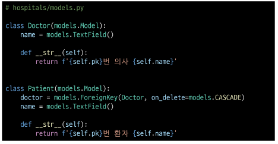

### 의사와 환자 데이터 생성

- 2명의 의사와 환자를 생성하고 환자는 서로 다른 의사에게 예약

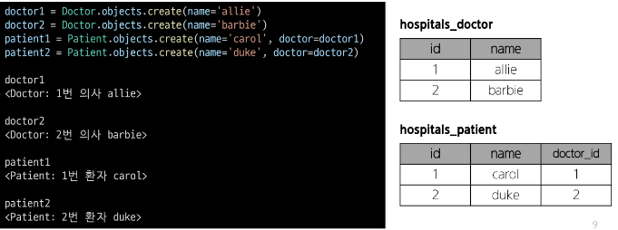

### N:1의 한계 상황

- 1번 환자(carol)가 두 의사 모두에게 진료를 받고자 한다면 환자 테이블에 1번 환자 데이터가 중복으로 입력될 수 밖에 없음

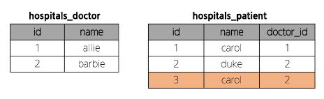

- 동시에 예약을 남길 수는 없을까?

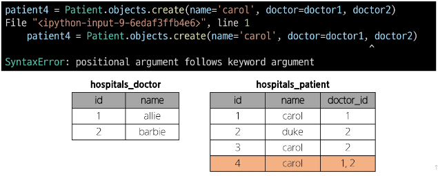

- 동일한 환자지만 다른 의사에게도 진료 받기 위해 예약하기 위해서는 객체를 하나 더 만들어 진행해야 함

- 외래 키 칼럼에 '1, 2'형태로 저장하는 것은 DB 타입 문제로 불가능

- > "예약 테이블을 따로 만들자."

## 중개 모델

1. 예약 모델 생성

- 환자 모델의 외래 키를 삭제하고 별도의 예약 모델을 새로 생성

- 예약 모델은 의사와 환자에 각각 N:1 관계를 가짐

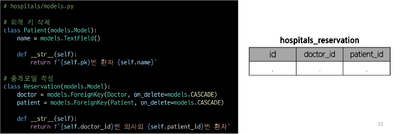

2. 예약 데이터 생성

- 데이터베이스 초기화 후 Migration 진행 및 shell_plus 실행

- 의사와 환자 생성 후 예약 만들기

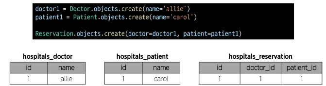

3. 예약 정보 조회

- 의사와 환자가 예약 모델을 통해 각각 본인의 진료 내역 확인

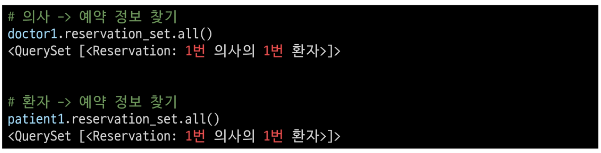

4. 추가 예약 생성

- 1번 의사에게 새로운 환자 예약 생성

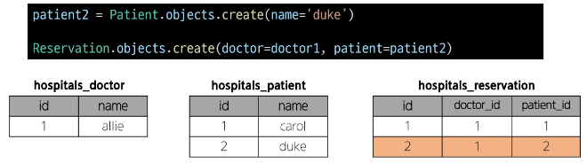

5. 예약 정보 조회

- 1번 의사의 예약 정보 조회

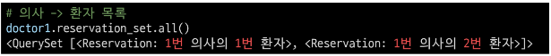

### Django에서는 'ManyToManyField'로 중개모델을 자동으로 생성

## ManyToManyField

### ManyToManyField()

- M:N 관계 설정 모델 필드

### Django ManyToManyField

- 환자 모델에 ManyToManyField 작성
    - 의사 모델에 작성해도 상관 없으며 참조/역참조 관계만 잘 기억할 것

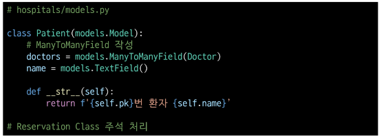

- 데이터베이스 초기화 후 Migration 진행 및 sehll_plus 실행

- 생성된 중개 테이블 hospitals_patient_doctors 확인

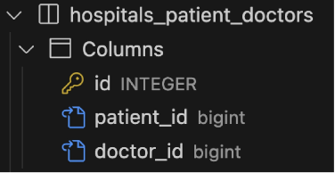

- 의사 1명과 환자 2명 생성

- 예약 생성 (환자가 예약)

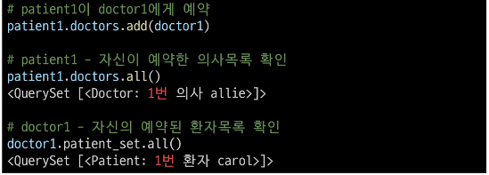

- 예약 생성 (의사가 예약)

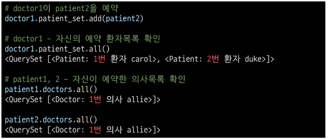

- 중개 테이블에서 예약 현황 확인

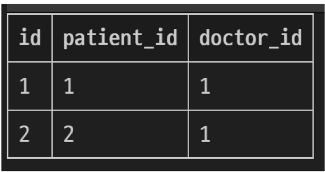

 - 예약 취소하기 (삭제)

 - 이전에는 Reservation을 찾아서 지워야 했다면, 이제는 .remove()로 삭제 가능

 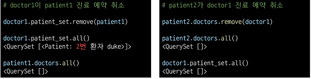

 ### 만약 예약 정보에 병의 증상, 예약일 등 추가 정보가 포함되어야 한다면?

 ## 'through' argument

 ### 'through' argument

 - 중개 테이블에 '추가 데이터'를 사용해 M:N 관계를 형성하려는 경우에 사용

 - Reservation Class 재작성 및 through 설정
    - 이제는 예약 정보에 "증상"과 예약일"이라는 추가 데이터가 생김

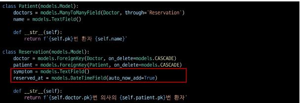

- 데이터베이스 초기화 후 Migration 진행 및 shell_plus 진행

- 의사 1명과 환자 2명 생성

- 예약 생성 방법 - 1
    - Reservation class를 통한 예약 생성

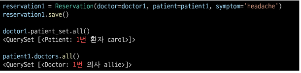

- 예약 생성 방법 - 2
    - Patient또는 Doctor의 인스턴스를 통한 예약 생성(through_defaults)

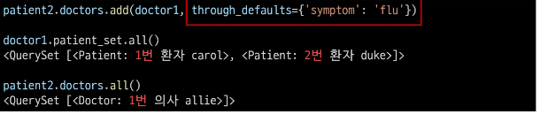

- 생성된 예약 확인

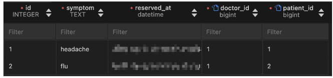

- 생성과 마찬가지로 의사와 환자 모두 각각 예약 삭제 가능

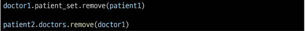

### M:N 관계 주요 사항

- M:N 관계로 맺어진 두 테이블에는 물리적인 변화가 없음

- ManyToManyField는 중개 테이블을 자동으로 생성

- ManyToManyField는 M:N 관계를 맺는 두 모델 어디에 위치해도 상관 없음
    - 대신 필드 작성 위치에 따라 참조와 역참조 방향을 주의할 것

- N:1은 완전한 종속의 관계였지만 M:N은 종속적인 관계가 아니며 '의사에게 진찰받는 환자 & 환자를 진찰하는 의사' 이렇게 2가지 형태 모두 표현 가능

# ManyToManyField

### ManyToManyField(to, **options)

- M:N 관계 설정 시 사용하는 모델 필드

### ManyToManyField 특징

- 양방향 관계
    - 어느 모델에서든 관련 객체에 접근할 수 있음

- 중복 방지
    - 동일한 관계는 한 번만 저장됨

### ManyToManyField의 대표 인자 3가지

1. related_name

2. symmetrical

3. through

----

1. 'related_name' arguments

- 역참조시 사용하는 manager name을 변경

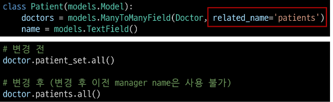

2. 'symmetrical' arguments

- 관계 설정 시 대칭 유무 설정

- ManyToManyField가 동일한 모델을 가리키는 정의에서만 사용

- 기본 값 : True

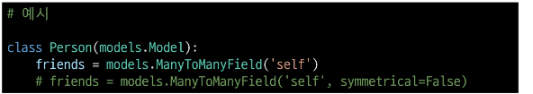

- True일 경우
    - source 모델의 인스턴스가 target 모델의 인스턴스를 참조하면 자동으로 target 모델 인스턴스도 source 모델 인스턴스를 자동으로 참조하도록 함(대칭)
    - 즉, 내가 당신의 친구라면 자동으로 당신도 내 친구가 됨

- False일 경우
    - True와 반대 (대칭되지 않음)

    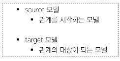

3. 'through' arguments

- 사용하고자 하는 중개모델을 지정

- 일반적으로 "추가 데이터를 M:N 관계와 연결하려는 경우"에 활용

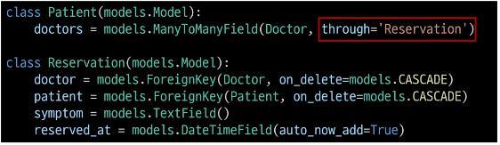

### M:N에서의 대표 조작 methods

- add()
    - 관계 추가
    - "지정된 객체를 관련 객체 집합에 추가"

- remove()
    - 관계 제거
    - "관련 객체 집합에서 지정된 모델 객체를 제거"

# 좋아요 기능 구현

## 모델 관계 설정

### Many to many relationships

- 한 테이블의 0개 이상의 레코드가 다른 테이블의 0개 이상의 레코드와 관련된 경우
    - 양쪽 모두에서 N:1 관계를 가짐

### Article(M) - User(N)

- 0개 이상의 게시글은 0명 이상의 회원과 관련

- > 게시글은 회원으로부터 0개 이상의 좋아요를 받을 수 있고, 회원은 0개 이상의 게시글에 좋아요를 누를 수 있음

### 모델 관계 설정

- Article 클래스에 ManyToManyField 작성

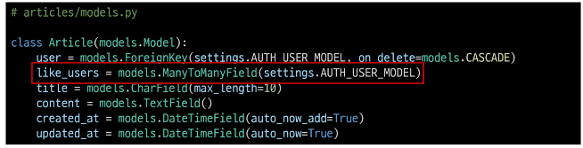

- Migration 진행 후 에러 발생

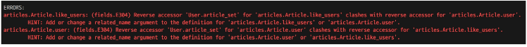

----
### 역참조 매니저 충돌

- N:1
    - "유저가 작성한 게시글"
    - user.article_set.all()

- M:N
    - "유저가 좋아요 한 게시글"
    - user.article_set.all()

- like_users 필드 생성 시 자동으로 역참조 매니저 .article_set가 생성됨
- 그러나 이전 N:1(Article-User) 관계에서 이미 같은 이름의 매니저를 사용 중
    - user.article_set.all() -> 해당 유저가 작성한 모든 게시글 조회
- 'user가 작성한 글 (user.article_set)'과 'user가 좋아요를 누른 글(user.article_set)'을 구분할 수 없게 됨

- > user와 관계된 ForeignKey 혹은 ManyToManyField 둘 중 하나에 related_name 작성 필요

----

### 모델 관계 설정

- related_name 작성 후 Migration 재진행

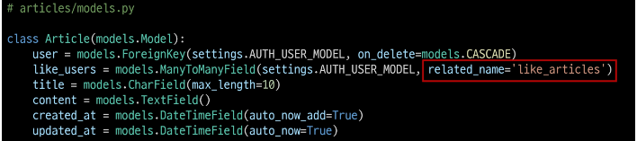

- 생성된 중개 테이블 확인

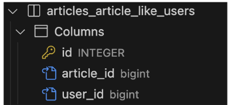

### User - Article간 사용 가능한 전체 related manager

- article.user
    - 게시글을 작성한 유저 - N:1

- user.article_set
    - 유저가 작성한 게시글(역참조) - N:1

- article.like_users
    - 게시글을 좋아요 한 유저 - M:N

- user.like_articles
    - 유저가 좋아요 한 게시글(역참조) - M:N

## 기능 구현

- url 작성

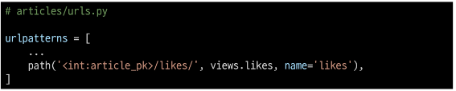

- view 함수 작성

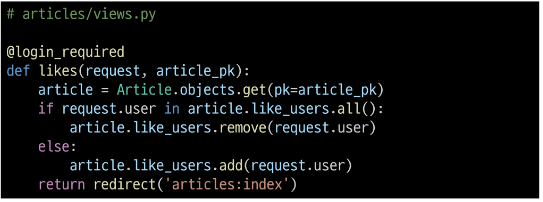

- index 템플릿에서 각 게시글에 좋아요 버튼 출력

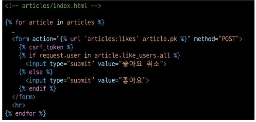

- 좋아요 버튼 출력 확인

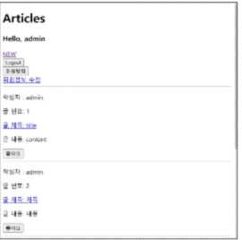

- 좋아요 버튼 클릭 후 테이블 확인

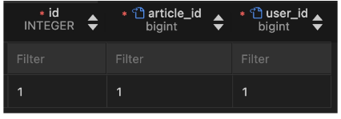

# 팔로우 기능 구현

## 프로필 페이지

- 각 회원의 개인 프로필 페이지에 팔로우 기능을 구현하기 위해 프로필 페이지를 먼저 구현하기

### 프로필 구현

- url 작성

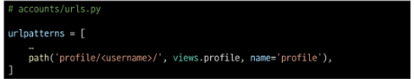

- view 함수 작성

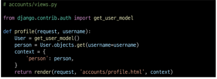

- profile 템플릿 작성

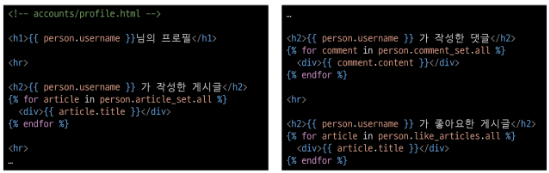

- 프로필 페이지로 이동할 수 있는 링크 작성

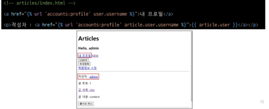

- 프로필 페이지 결과 확인

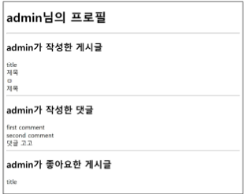

## 모델 관계 설정

### User(M) - User(M)

- 0명 이상의 회원은 0명 이상의 회원과 관련

- > 회원은 0명 이상의 팔로워를 가질 수 있고, 0명 이상의 다른 회원들을 팔로잉 할 수 있음

### 모델 관계 설정

- ManyToManyField 작성

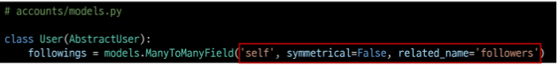

- 참조
    - 내가 팔로우하는 사람들 (팔로잉, followings)

- 역참조
    - 상대방 입장에서 나는 팔로워 중 한 명 (팔로워, followers)

- 바뀌어도 상관 없으나 관계 조회 시 생각하기 편한 방향으로 정한 것

- Migrations 진행 후 중개 테이블 확인

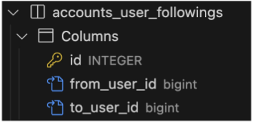 

## 기능 구현

- url 작성

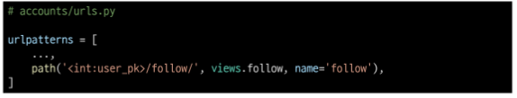

- view 함수 작성

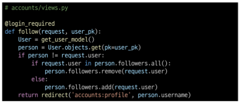

- 프로필 유저의 팔로잉, 팔로워 수 & 팔로우, 언팔로우 버튼 작성

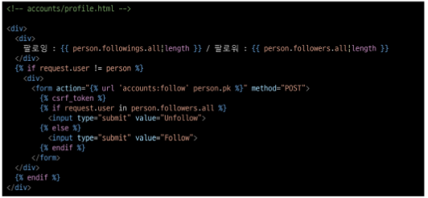

- 팔로우 버튼 클릭 -> 팔로우 버튼 변화 및 중개 테이블 데이터 확인

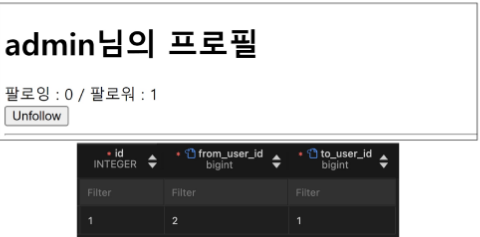

# Fixtures

## 개요

### Fixtures

- Django 개발 시 데이터 베이스 초기화 및 공유를 위해 사용되는 파일 형식

### Fixtures 사용 목적

- 샘플, 초기 데이터 세팅

- 협업 시 동일한 데이터 환경 맞추기

### 초기 데이터의 필요성

- 협업하는 유저 A, B가 있다고 생각해보기
    
    1. A가 먼저 프로젝트를 작업 후 원격 저장소에 push 진행
        - gitignore로 인해 DB는 업로드하지 않기 때문에 A가 생성한 데이터도 업로드 X
    2. B가 원격 저장소에서 A가 push한 프로젝트를 pull (혹은 clone)
        - 결과적으로 B는 DB가 없는 프로젝트를 받게 됨

- 이처럼 프로젝트의 앱을 처음 설정할 때 동일하게 준비 된 데이터로 데이터베이스를 미리 채우는 것이 필요한 순간이 있음

- > Django에서는 fixtures를 사용해 앱에 초기 데이터(initial data)를 제공

### fixtures 관련 명령어

- dumpdata : 생성(데이터 추출)

- loaddata : 로드 (데이터 입력)

### 사전 준비

- M:N 까지 모두 작성된 Django 프로젝트에서 유저, 게시글, 댓글 등 각 데이터를 최소 2~3개 이상 생성해두기

## dumpdata

- 데이터베이스의 특정 모델 혹은 앱 전체 데이터를 추출

### dumpdata 기본 명령어

- 앱이름.모델이름 지정
    - 특정 모델의 데이터를 추출

- 앱이름만 지정
    - 해당 앱의 모든 모델에 대한 데이터를 추출

- 앱 혹은 모델명을 지정하지 않은 경우
    - 프로젝트 전체의 모델 데이터를 추출

- --format 옵셥을 통해 JSON, YAML 등의 형식 지정 가능 (기본값:JSON)``

### dumpdata 명령어 예시

- articles 앱의 Article 모델 데이터를 추출

- 명령어 실행 후 프로젝트 폴더에 articles.json 파일이 생성됨

- articles.json 파일에는 Article 모델의 모든 데이터가 JSON 형식으로 작성되어 있음

- Fixtures 파일명은 자유롭게 작성 가능

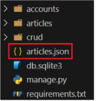

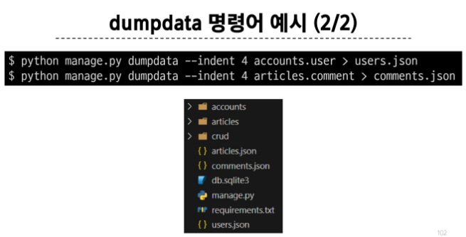

### Fixtures 파일을 직접 만들지 말 것

- 반드시 dumpdata 명령어를 사용하여 생성

### dumpdata 정리

- dumpdata 명령어를 사용하면 프로젝트 내 특정 앱 혹은 모델에 대한 데이터를 JSON등 원하는 포맷으로 추출 가능

- 이렇게 생성된 데이터 파일은 추후 다른 환경에서 loaddata로 불러와 동일한 데이터 상태를 재현할 수 있으며, 협업 및 배포에 큰 장점이 있음

## loaddata

- dumpdata를 통해 추출한 데이터 파일을 다시 데이터베이스에 반영

### loaddata 기본 명령어

- Fixtures 파일의 기본 경로에 있는 파일을 DB에 반영

- Fixtures 파일의 기본 경로
    - app_name/fixtures/

- Django는 설치된 모든 app의 디렉토리에서 fixtures 폴더 이후의 경로로 fixtures 파일을 찾아 load를 진행

### 사전준비

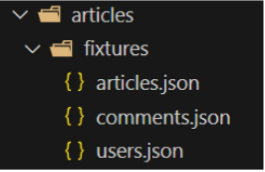

- dumpdata로 생성한 파일들을 해당 위치로 이동

- db.sqlite3 파일 삭제 후 migrate 진행

### loaddata 명령어 예시

- dumpdata로 생성한 파일들을 모두 DB에 반영

- 파일은 작성 순서에 상관 없음

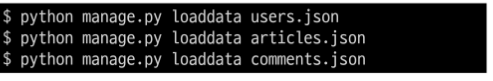

- 단, loaddata를 한번에 실행하지 않고 별도로 실행한다면 모델 관계에 따라 load 순서가 중요할 수 있음
    - comment는 article에 대한 key 및 user에 대한 key가 필요
    - article은 user에 대한 key가 필요

- 즉, 현재 모델 관계에서는 user -> article -> comment 순으로 data를 load해야 오류가 발생하지 않음

### loaddata 주의사항

- loaddata를 실행하기 전에 해당 모델에 대한 마이그레이션이 완료되어 있어야 함

- 같은 PK를 가진 데이터가 이미 있는 경우 중복 에러가 발생할 수 있음
    - 이 경우 기존 데이터를 지우거나, 새로운 Fixture 파일을 사용해야 함

### loaddata 정리

- loaddata 명령어는 dumpdata로 추출한 Fixture 파일을 DB로 불러오는 명령어이며, 개발 환경 준비나 협업 시 매우 유용

- 마이그레이션 상태를 먼저 확인하고, 인코딩 문제 등을 사전에 해결하면 매끄럽게 데이터를 복원할 수 있음

# Improve query

## 사전 준비

### Improve query

- "query 개선하기"

- > 같은 결과를 얻기 위해 DB 측에 보내는 query 개수를 점차 줄여 조회하기

### 사전 준비

- fixtures 데이터
    - 게시글 10개 / 댓글 100개 / 유저 5개

- 모델 관계
    - N:1 - Article:User / Comment:Article / Comment:Article
    - N:M - Article:User

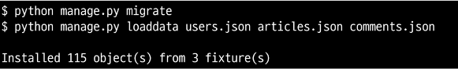

- 서버 실행 후 확인

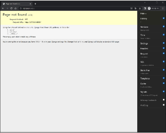

### annotate

- SQL의 GROUP BY를 사용

- 쿼리셋의 각 객체에 계산된 필드를 추가

- 집계 합수(Count, Sum 등)와 함게 자주 사용됨

### annotate 예시

- 의미
    - 결과 객체에 'num_authors'라는 새로운 필드를 추가
    - 이 필드는 각 책과 연관된 저자의 수를 계산

- 결과
    - 결과에는 기존 필드와 함께 'num_authors' 필드를 가지게 됨
    - book.num_authors로 해당 책의 저자 수에 접근할 수 있게 됨

### 문제 상황

- 문제 원인
    - 각 게시글마다 댓글 개수를 반복 평가

### annotate 적용

- 문제 해결
    - 게시글을 조회하면서 댓글 개수까지 한번에 조회해서 가져오기

- 문제 해결
    - "11 queries including 10 similar" -> "1 query"

    

## select_related

- SQL의 INNER JOIN를 사용

- 1:1 또는 N:1 참조 관계에서 사용
    - ForeignKey나 OneToOneField 관계에 대해 JOIN을 수행

- 단일 쿼리로 관련 객체를 함께 가져와 성능을 향상

### select_related 예시

- 의미
    - Book 모델과 연관된 Publisher 모델의 데이터를 함께 가져옴
    - ForeignKey 관계인 'publisher'를 JOIN하여 단일 쿼리 만으로 데이터를 조회

- 결과
    - Book 객체를 조회할 때 연관된 Publisher 정보도 함께 로드
    - book.publisher.name과 같은 접근이 추가적인 데이터베이스 쿼리 없이 가능

### 문제 상황

- 문제 원인
    - 각 게시글마다 작성한 유저명까지 반복 평가

### select_related 적용

- 문제 햐결
    - 게시글을 조회하면서 유저 정보까지 한번에 조회해서 가져오기

- 문제 해결
    - "11 queries including 10 similar and 8 duplicates" -> "1 query"

    

## prefetch_related

- SQL이 아닌 Python을 사용한 JOIN을 진행
    - 관련 객체들을 미리 가져와 메모리에 저장하여 성능을 향상

- M:N 또는 N:1 역참조 관계에서 사용
    - ManyToManyField나 역참조 관계에 대해 별도의 쿼리를 실행

### prefetch_related 예시

- 의미
    - Book과 Author는 ManyToMany 관계로 가정
    - Book 모델과 연관된 모든 Author 모델의 데이터를 미리 가져옴
    - Django가 별도의 쿼리로 Author 데이터를 가져와 관계를 설정

- 결과
    - Book 객체들을 조회한 후, 연관된 모든 Author 정보가 미리 로드 됨
    - for author in book.authors.all()와 같은 반복이 추가적인 데이터베이스 쿼리 없이 실행됨

### 문제 상황

- 문제 원인
    - 각 게시글 출력 후 각 게시글의 댓글 목록까지 개별적으로 모두 평가

    

### prefetch_related 적용

- 문제 해결
    - 게시글을 조회하면서 참조된 댓글까지 한번에 조회해서 가져오기

    

- 문제 해결
    - "11 queries including 10 similar" -> "2 queries"

    

## select_related & prefetch_related

### 문제 상황

- 문제 원인
    - "게시글" + "각 게시글의 댓글 목록" + "댓글의 작성자"를 단계적으로 평가

    

### prefetch_related 적용

- 문제 해결 1단계
    - 게시글을 조회하면서 참조된 댓글까지 한번에 조회

### select_related & prefetch_related 적용

- 문제 해결 2단계
    - "게시글" + "각 게시글의 댓글 목록" + "댓글의 작성자"를 한번에 조회

## 최적화 주의사항

### 섣부른 최적화는 악의 근원

- "작은 효율성에 대해서는, 말하자면 97% 정도에 대해서는, 잊어버려라. 섣부른 최적화는 모든 악의 근원이다." - 도널드 커누스(Donald E. Knuth)

# <참고>

## 'exists' method

### .exists()

- QuerySet에 결과가 하나 이상 존재하는지 여부를 확인하는 메서드

- 결과가 포함되어 있으면 True를 반환하고 결과가 포함되어 있지 않으면 False를 반환

### .exists() 특징

- 데이터베이스에 최소한의 쿼리만 실행하여 효율적

- 전체 QuerySet을 평가하지 않고 결과의 존재 여부만 확인

- > 대량의 QuerySet에 있는 특정 객체 검색에 유용

### exists 적용 예시

## 한꺼번에 dump 하기

- 다만 모든 데이터를 한 번에 추출 할 경우 파일 용량이 커질 수 있으므로, 필요에 따라 특정 앱만 추출하거나, 파일을 압축하여 관리하는 방법을 고려

- 데이터 베이스 변경이 잦은 경우 전체 추출보다는 앱 단위 또는 모델 단위로 관리하는 편이 유지 보수에 용이

## loaddata 인코딩 에러 해결법

### 인코딩 문제

- JSON 파일 생성 및 로딩 시, 파일이 특정 문자 인코등(예: UTF-8)으로 저장되지 않으면 한글 등 비 ASCII 문자가 깨지거나, UnicodeDecodeError등의 에러가 발생할 수 있음

- 윈도우 환경에서 생성한 파일을 리눅스 환경을에서 로딩 할 때, 혹은 반대 상황에서 인코딩 이슈가 빈번히 발생

### 해결 방법 1.

- dumpdata시 추가 명령어 작성

### 해결 방법 2.

- 이미 추출된 fixtures 파일이 있다면 에디터(메모장, VSCode 등)에서 파일을 열고 인코딩을 UTF-8로 지정한 뒤 다시 저장

