# 데이터 베이스 모델링

## 개요요

### Database Modeling

- 데이터베이스 시스템을 구축하기 위해, 데이터의 구조와 관계, 제약 조건 등을 설계하여 효율적이고 일관성 있는 데이터베이스를 만들기 위한 과정

- 모델링을 통해 성능, 무결성, 신뢰성을 보장할 수 있음

### Database Modeling의 중요성

- 효율성
  - 데이터베이스 구조를 잘 설계하면 쿼리 성능과 저장 효율이 향상

- 일관성
  - 중복과 이상 현상을 최소화하여, 데이터가 서로 모순되거나 충돌하지 않도록 함

- 무결성 보장
  - 무결성 제약 조건을 모델링 단계에서 설정해두어, 부적절한 데이터를 방지

## 무결성 제약 조건

### 무결성

- 데이터베이스가 잘못된 데이터의 삽입-수정-삭제로부터 보호되어, 데이터의 일관성과 신뢰성을 유지하는 것

### 대표적인 무결성 제약 조건

1. 개체 무결성

2. 참조 무결성

3. 도메인 무결성

### 1. 개체 무결성 (Entity Integrity)

- 기본 키(Primary key)가 유일(중복 불가)하고 'NULL'값을 허용하지 않는 제약

- 핵심 원칙
  
  1. 각 레코드는 유일한 식별자를 가져야 함 (PK 중복 불가)
  2. 기본 키는 NULL 값을 가질 수 없음(필수 값)

  

### 2. 참조 무결성 (Referential Integrity)

- 외래 키와 관련된 제약으로, 존재하지 않는 기본 키를 참조하지 못하도록 하는 규칙

- 핵심 원칙

  1. 외래 키는 참조 대상 테이블의 기본 키 값을 참조하거나 'NULL'을 가질 수 있음

  2. 참조 대상 테이블에 존재하지 않는 기본 키 값은 사용할 수 없음

  3. 외래 키로 연결된 레코드를 삭제-수정할 때, 연쇄 작업(ON DELETE CASCADE 등) 또는 예외 처리를 통해 무결성 유지

### 3. 도메인 무결성 (Domain Integrity)

- 각 속성(컬럼)이 정의된 도메인(값의 범위, 형식)을 벗어나지 않도록 하는 제약

- 핵심 원칙

  1. 속성별로 데이터 타입, 길이, 범위 등을 정의해야 함
  2. 값이 해당 범위(도메인)를 벗어나면 삽입-수정이 제한되거나 오류 발생

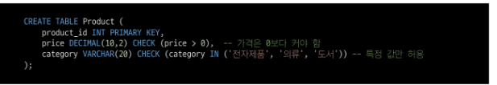

### 그 외 무결성 제약 조건

1. 고유성(UNIQUE)

- 특정 컬럼의 값이 테이블 내에서 중복되지 않도록 제한
- 예 : 이메일 주소는 한 사용자가 하나만 등록 가능

2. NULL 무결성 (NOT NULL)
  - 특정 컬럼이 NULL 값을 가질 수 없도록 하는 제약

3. 일반 무결성 (General Intergrity)
  - 위의 특정 제약조건 외에도, 비즈니스 로직에 따라 추가로 정의하는 무결성 규칙.
  - 예: 은행 잔고가 0 미만이 되지 않도록 하거나, 재고 수량이 음수가 되지 않도록 하는 규칙

## 모델링 과정 4단계

### 데이터베이스 모델링 진행

- 요구사항 수집 및 분석 -> 개념적 설계 -> 논리적 설계 -> 물리적 설계

### 1. 요구사항 수집 및 분석

- 어떤 종류의 데이터를 정리하는지 정보 수집하고 어떤 작업을 수행해야 하는지 파악하는 단계
  - 개체 (Entity)
    - 업무에 필요하고 유용한 정보를 저장하는 집합적인 것
    - 예) 고객, 상품

  - 속성 (Attribute)
    - 관리하고자 하는 것의 의미를 더 이상 작은 단위로 분리되지 않은 데이터 단위
    - 예) 고객명, 고객 전화번호, 상품명, 상품 가격

  - 관계 (Relationship)
    - 객체 사이의 논리적인 연관성을 의미하는 것
    - 예) 고객은 다수의 상품을 주문, 상품은 다수의 고객들에게 판매될 수 있음

### 2. 개념적 설계

- 요구사항을 기반으로 데이터베이스의 개념적 모델을 설계

- 개체(Entity)와 관계(Relationship)를 식별하고, 개체 간의 관계를 정의하여 ER Diagram을 작성

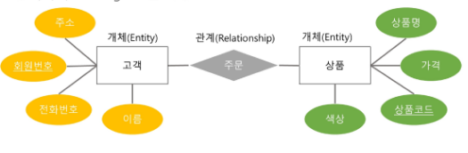

### ERD 표기 방법

- 까마귀 발 모델 (Crow's Foot Model) 표기법

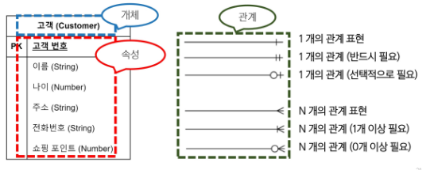

- N:M 관계 예시

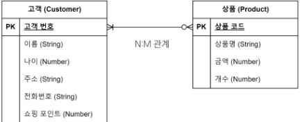

### 3. 논리적 설계

- 개념적 설계를 기반으로 데이터베이스의 논리적 구조를 설계

- 테이블, 칼럼(속성), 제약 조건 등과 같은 구체적인 데이터베이스 개체를 정의

- 정규화를 수행하여 데이터의 중복을 최소화하고 일관성을 유지

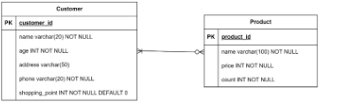

### 4. 물리적 설계

- 논리적 설계를 기반으로 데이터베이스를 실제 저장 및 운영 할 수 있는 형태로 변환하는 단계

- 테이블의 인덱스, 파티션, 클러스터링 등 물리적인 구조와 접근 방식을 결정

- 보안, 백업 및 복구, 성능 최적화 등을 고려하여 데이터베이스를 설정

# 데이터베이스 정규화

## 정규화

### 정규화(Normalization)

- 데이터 중복을 최소화하고, 이상 현상을 예방하며, 데이터베이스 구조 변경 시 재작업을 줄이는 목적으로 테이블을 구조화하는 과정

### 정규화 목적

1. 중복 최소화
  - 불필요한 중복 데이터를 제거해 일관성 유지

2. 이상 현상 방지
  - 삽입, 갱신, 삭제 작업 시 발생할 수 있는 불일치 문제 예방

3. 유연성 향상
  - 데이터베이스 구조 변경 시 영향을 받는 영역을 최소화하여 유지보수성을 높임

## 이상 현상

### 이상 현상(Anomaly)

- 데이터베이스를 비정상적으로 설계 했을 때 중복된 데이터가 많아져 삽입, 갱신, 삭제 등의 연산에서 비일관성이 생기는 문제

### 이상 현상 종류

1. 삽입 이상 (Insertion Anomaly)
 - 새로운 데이터를 삽입하기 위해 불필요한 데이터도 함께 삽입해야 하는 문제

2. 갱신 이상 (Update Anomaly)
  - 중복된 데이터 중 일부만 변경되어 데이터 불일치가 발생하는 문제

3. 삭제 이상 (Deletion Anomaly)
  - 어떤 데이터를 삭제할 때, 반드시 있어야 하는 정보까지 같이 사라지는 문제

### 삽입 이상

- Recipe table에 삽입된 데이터 정보가 아래와 같을 때
- "마늘" 식재료가 추가 되어야 한다면, 마늘 정보를 어디에 삽입 해야 하는가?

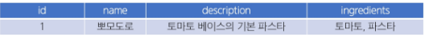

- "마늘" 재료만 미리 등록하고 싶어도, 요리 이름이 필요하다는 이유로 가짜 name과 description 등을 만들어야 함

- 새로운 재료 또는 부분적인 정보만을 삽입하기 위해 불필요한 레시피 정보까지 억지로 입력해야 하는 상황이 "삽입 이상"

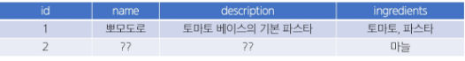

### 갱신 이상

- "파스타"라는 재료명을 "스파게티"로 변경하고자 하는 상황

- 현재 테이블에서 재료가 문자열로 저장되고 있으므로, ingredients 컬럼 내 "파스타"라는 부분 문자열을 모두 찾아서 일괄 변경해야 함

- 여러 요리에 "토마토, 파스타", "파스타,치즈,면" 등으로 저장되어 있을 수 있는데, 어떤 행은 업데이트가 누락되면, "파스타"와 "스파게티"가 혼재하는 불일치 상황 발생

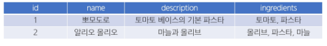

- 중복된 데이터가 여러 행에 문자열 형태로 산재해 있어, 수정 시 모두 찾아서 변경해야 함.
- 일부만 수정하면 불일치(데이터 모순)가 생기는 문제를 갱신 이상이라 함

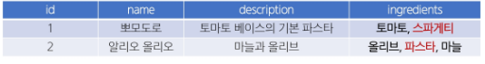

### 삭제 이상

- "명란 파스타" 정보를 삭제하고자 함

- 이 레시피의 식재료 컬럼에는 올리브, 스파게티, 명란젓이 포함되어 있었음

- 만약 이 테이블에서만 "명란젓"이란 재료 정보를 유일하게 보관하고 있었다면, 해당 행 삭제와 함께 "명란젓" 재료 자체에 대한 정보도 소실되는 경롸 초래

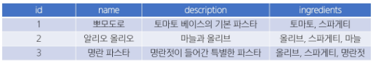

- 특정 레시피(행)를 지울 때, 그 행 안에 있는 재료에 대한 정보까지 같이 사라짐.

- 실제로는 "재료 정보" 자체는 남겨두고 싶었지만, 테이블 구조상 둘이 붙어 있어서 불필요하게 삭제되는 것이 삭제 이상

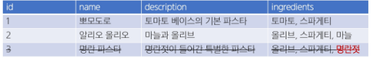

### 문제 원인

- 하나의 테이블에 요리에 대한 설명, 식별자, 재료 정보 등이 중복된 구조로 뒤섞여 있음

- 재료와 레시피의 관계가 1:N or N:M일 수 도 있음에도, 단일 필드(ingredients)로 모아둔 상태

### 해결 방법 (정규화)

1. 재료(Ingredient)를 별도 테이블로 분리

2. 레시피(Recipe) 테이블 <-> 재료(Ingredient) 테이블 간 N:M(ManyToMany) 구조를 설정
  - 예: 중게 테이블 Recipe_Ingredient(recipe_id, ingredient_id)

3. 그렇게 하면

  - 삽입 이상 : "마늘"만 등록할 수 있음(Ingredient 테이블). 레시피 미정이어도 문제 없음

  - 갱신 이상 : "파스타" -> "스파게티"를 Ingredient 테이블에서 한 번만 수정하면, 모든 레시피에 반영

  - 삭제 이상 : 레시피 삭제 시 Ingredient 테이블의 "명란젓"은 남아있을 수 있음 (모두 연결 끊긴 경우에만 자동 삭제 여부를 결정할 수 있음)

## 정규화 종류

- 일반적으로 1NF(제1 정규형)에서 시작해, 2NF, 3NF 순으로 진행하며, 필요에 따라 BCNF 이상(4NF, 5NF, 6NF)까지 고려하기도 함

- 실무에서는 보통 3NF 또는 BCNF까지 도달하면 정규화가 이루어졌다고 표현

### 각 정규화 단계

- 제 1 정규형 (1NF)
  - 각 요소의 중복되는 항목이 없어야 한다.

- 제 2 정규형 (2NF)
  - 제 1 정규형을 만족하면서 PK가 아닌 모든 속성이 PK에 완전 함수 종속되어야 한다.

- 제 3 정규형 (3NF)
  - 제 2 정규형을 만족하면서 모든 속성이 PK에 이행적 함수 종속이 되지 않아야 한다.

- BCNF (Boyce Codd Normalization Form)
  - 제 3 정규형을 만족하면서, 모든 결정자가 후보 키여야 한다.

## 1NF

### 제 1 정규형 (1NF)

1. 각 속성(컬럼)이 원자 값(Atomic Value), 즉 하나의 값만 가져야 함

2. 중복된 컬럼이 없어야 함

3. 각 행(row)이 유일하게 식별될 수 있어야 함 (기본 키 존재)

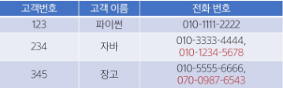

### 제 1 정규형 시도

- 2개를 초과하는 전화번호를 저장할 수 없음

- 해결을 위해 column을 추가하는 경우, 불필요한 NULL 값을 가지게 됨

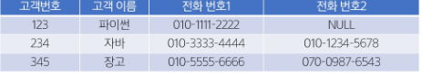

- 동일 데이터를 여러 row로 나누어서 저장하는 경우, 기본 키가 중복 됨

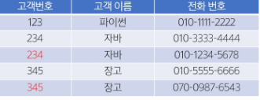

### 제 1 정규형 결과

- 고객 번호를 참조하여, 전화번호를 저장하는 테이블을 분리

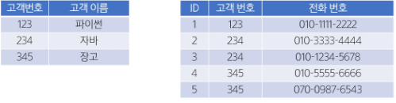

## 2NF

### 제 2 정규형 (2NF)

1. 제 1 정규형을 만족해야 함

2. 복합 키 (두 개 이상의 컬럼으로 이루어진 기본 키)를 사용하는 테이블에서 모든 비(非) 기본 키 속성이 기본 키의 모든 컬럼에 완전 종속되어야 함
  - 즉, 부분 함수 종속(기본 키 일부 컬럼만으로 해당 속성이 결정되는 것)을 제거

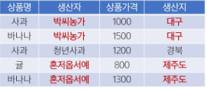

### 제 2 정규형 진행

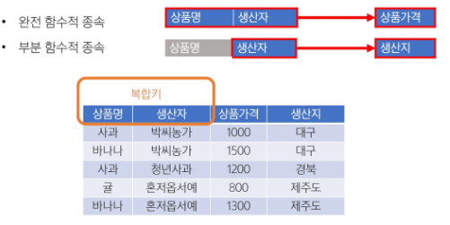

### 제 2 정규형 결과

- "생산자"와 "생산지"가 완전 함수적 종속이 되도록 테이블 분리

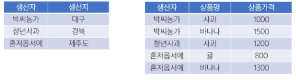

## 3NF

### 제 3 정규형 (3NF)

1. 제 2 정규형을 만족해야 함

2. 기본 키에 대한 이행적 함수 종속(Transitive Dependency)이 없어야 함
  - A->B, B->C 인 경우, A->C를 "이행 종속"이라 부름
  - 기본 키가 아닌 속성이 다른 속성(역시 기본 키가 아닌)에 의해 결정되지 않아야 함

- 예
  - 학생 테이블에서 학과 번호 -> 학과 명 -> 대학 이름 식으로 이어진다면,
  "학과 번호 -> 대학 이름" 부분을 별도 테이블로 분리

### 제 3 정규형 진행

- 기본 키(PK)가 아닌 속성 간의 종속성을 제거해야 함

- 비(非) 기본 키 컬럼이 다른 비 기본 키 컬럼을 결정하면 안 됨
  - 학생번호 -> 학과, 학과 -> 학과장
  - 학생 번호는 학과장을 직접 결정하지 않음. -> 이행적 함수 종속 발생

  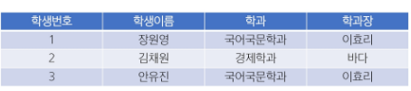

### 제 3 정규형 결과

- "학생정보"와 "학과정보"를 별도 테이블로 분리

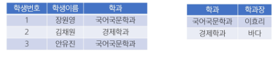

## BCNF

### BCNF (Boyce Codd Normal Form)

1. 제 3 정규형을 만족해야 함

2. 모든 결정자가 후보 키(Candidate key)여야 함

3. 3NF 이후에도 남아있는 이상 현상을 해결하는 더 엄격한 형태

4. 기본 키가 아닌 속성이 다른 컬럼을 결정할 수 없게끔 테이블을 분해

- 결정자 (determinant)란?
  - 관계형 테이블에서 함수적 종속성 X -> Y가 성립할 때, 좌변 X를 결정자라고 부름
  - 즉, X의 값이 같으면 Y의 값도 반드시 같다는 규칙에서 "다른 값을 결정(정의) 해야함

### 후보 키(Candidate Key)

- "모든 속성"을 결정하는 최소 결정자

- 한 테이블의 각 행(row)을 유일하게 식별 할 수 있는 속성(또는 속성 조합) 중 최소성을 만족하는 키

- 후보키의 조건
  - 유일성(Unique): 테이블의 각 행을 고유하게 식별 할 수 있어야 함
  - 최소성(Minimality): 불필요한 컬럼을 포함하지 않는, 최소한의 속성 조합이어야 함

- 한 테이블에 여러 후보 키가 있을 수 있으며, 그중 하나를 Primary key로 선택해야 함

### 후보 키 예시

- 학생번호 : 각 학생을 유일하게 식별 가능 -> 후보 키
- 주민등록번호 : 각 학생을 유일하게 식별 가능 -> 후보 키
- 전화번호: 일반적으로 유일할 가능성이 높지만, 변경될 수 있음 -> 후보 키 가능성 있음 X
- 이름 : 동명이인이 존재할 수 있음 -> 후보 키 불가능 X

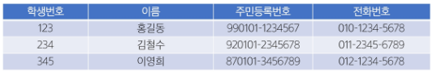

### BCNF 진행

- 각 교수는 정확히 한 과목만 담당한다고 가정
  - 담당 교수 -> 과목명

- 한 학생이 한 과목에 대해 받을 학점은 하나뿐
  - (학생번호, 과목명) -> 학점

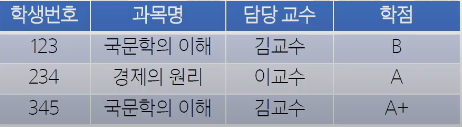

- 후보 키 찾기

- {학생번호, 과목명}
  - 두 속성을 함께 알면 다른 모든 속성(담당 교수, 학점)을 유일하게 결정
  - 후보 키를 만족

- 과목명만으로는 중복 학생이 있을 수 있고, 학생번호만으로는 여러 과목을 수강하므로 단독으로는 후보키가 아님

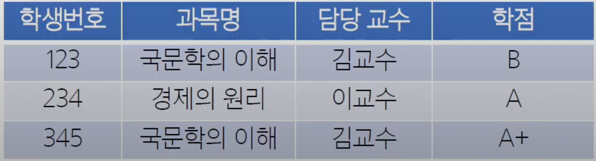

- BCNF 규칙 : 모든 결정자가(좌항)는 후보 키여야 함

1. (학생번호, 과목명) -> 학점
  - 결정자가 후보 키? YES

2. 담당 교수 -> 과목명
  - 결정자가 후보 키? NO (담당 교수는 후보 키가 아님)
  - BCNF 위반

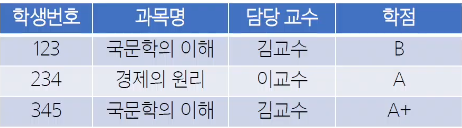

- 새로운 관계 설계

- 담당 교수 -> 과목명이 BCNF를 깨뜨리므로 이를 기준으로 분해

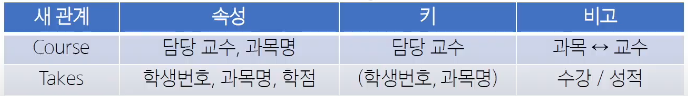

### BCNF 결과

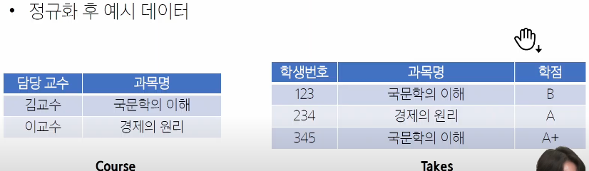

### 정규화 주의사항

- 3NF 이상으로 들어가면 BCNF, 4NF, 5NF, 6NF 등이 있으나, 지나친 분리로 인한 조인(Join)증가나 성능 저하 등의 문제가 발생

- 따라서 업무 요구에 따라 필요한 만큼 정규화/반정규화를 조정할 것을 권장

### 정리

- 정규화는 중복 데이터와 이상 현상을 줄이기 위한 DB 설계 기법

- 일반적으로 1NF -> 2NF -> 3NF 순으로 진행

- 이상 현상(Anomaly)
  - 삽입/갱신/삭제 작업에서 생길 수 있는 문제점을 예방

- BCNF
  - 3NF보다 엄격한 규칙으로, 모든 결정자는 후보 키가 되어야 함

- 정규화를 통해 데이터 무결성과 일관성을 확보하고, 유지보수 시 구조 변경 부담을 최소화할 수 있음

# 데이터베이스 모델링 실습

## 레시피 관리 프로젝트

### Recipe model

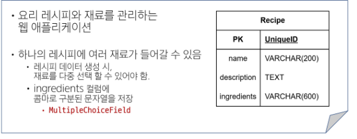

### Recipe Model class 정의

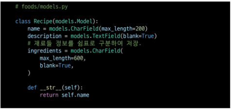

### RecipeForm ModelForm class 정의

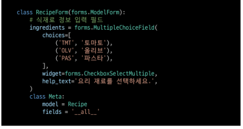

### Recipe 데이터 생성 화면

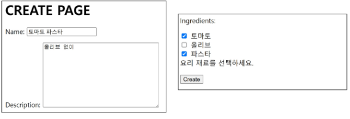

### Recipe 데이터 생성 결과

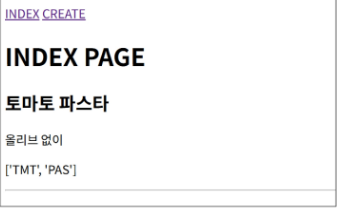

## 정규화 및 모델 정의

### 제 1 정규화

- 각 속성이 원자적(Atomic)이어야 함
  - 각 속성(컬럼)이 원자 값(Atomic Value, 하나의 값)만을 가져야 함.

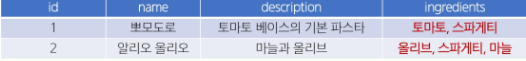

- 식재료를 저장하는 테이블을 분리

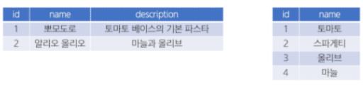

### 모델 관계 정의

- 레시피 테이블과 식재료 테이블의 관계를 위한 중개 모델 정의

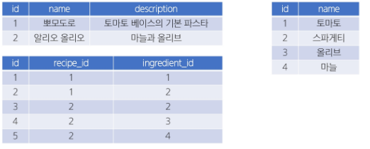

## 사전 준비 및 프로젝트 코드 확인

### 사전 준비

- 다대다 관계를 위한 ManyToManyField를 사용

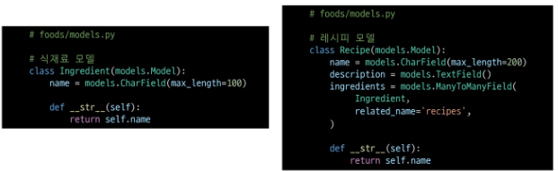

- 정의한 model을 DB에 반영

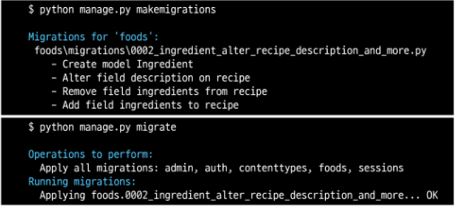

- Admin 페이지에 등록 후, 계정 생성 및 식재료 정보 생성

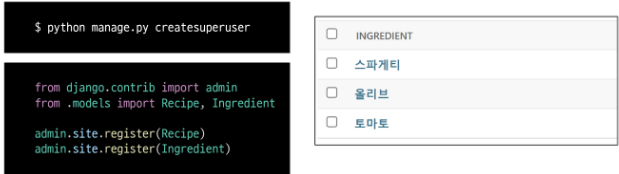

- 식재료 데이터 확인

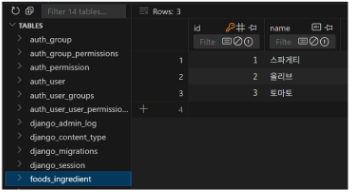

### RecipeForm 수정

- ingredients 필드를 위한 ModelMulipleChoiceField로 변경

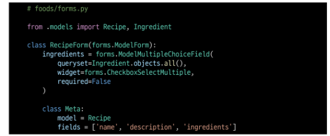

### queryset 속성

- queryset에는 "어떤 모델의 레코드를 선택지로 쓸 것인지"를 지정
  - 선택지에 사용할 (실제 필드에 저장될 값)을 해당 모델에서 직접 관리
    - 고유 값 설정 혹은 __str__ 등
    - 선택지 정보의 변동 사항을 form에서 직접 수정하지 않아도 됨

- 필요에 따라 대상 모델이 가진 레코드 중, 일부만 필터링 하여 사용 가능

### [참고] queryset 속성

- 필요에 따라 별도의 메서드를 정의하여 사용 할 수도 있음

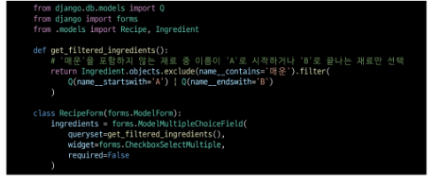

## 레시피 생성

### 레시피 생성 view와 template

- 기존의 게시글 작성 방식과 완전히 동일

- 식재료 정보는 관리자 페이지에서 생성 완료 하였음

- 레시피 정보 생성시 선택한 데이터는 ModelMultipleChoiceField에 의해 중개 모델에 저장 됨

- 즉, 저장 과정을 위해 별도 전처리 과정 불필요
  - EX) 쉼표로 구분하여 저장하는 등의 save 과정 수정 필요 없음.

- Widget을 사용하여 다중 선택이 가능한 checkbox 형태로 렌더링

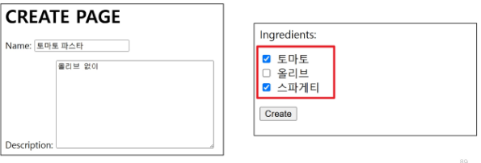

### 레시피 생성 결과 확인

- 레시피 테이블과 중개 테이블

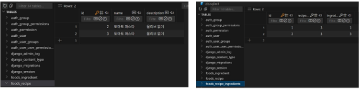

## 레시피 조회

### 레시피 조회

- Django M:N 관계의 역참조 매니저를 활용하여 렌더링

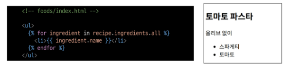

### [주의사항] Model 정의 시 MTM 주체

- 데이터 저장 시, 식재료 정보와의 관계를 저장하기 위한 별도의 전처리 과정이 필요 없었던 이유는 Recipe 모델이 주체였기 때문

- Recipe 모델이 Ingredient 모델과 ManyToManyField를 통해 관계를 직접 가지고 있음

- ModelForm이 Recipe.ingredients를 자동 인식

- form.save() 호출 시 ModelForm이 이 관계를 자동 처리 가능

- 반대의 경우, Recipe는 ingredients를 직접 필드로 가지지 않음

- 따라서 ModelForm에서는 이 필드를 감지하지 못하고

- form.save()시 관련 ManyToMany 관계는 무시됨

- 아래와 같은 추가적인 전처리 과정을 필요로 함

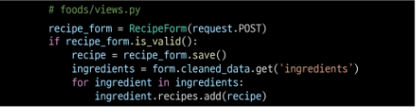