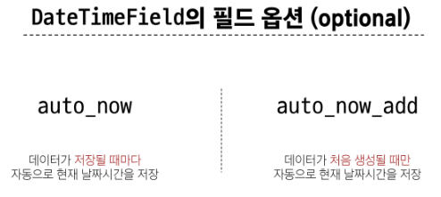

# Model

## model class

### Model을 통한 DB(데이터베이스) 관리


### Django Model

- DB의 테이블을 정의하고 데이터를 조작할 수 있는 기능들을 제공
  - -> 테이블 구조를 설계하는 '청사진(blueprint)'

### model 클래스 작성


### model 클래스 살펴보기

- 작성한 모델 클래스는 최종적으로 DB에 다음과 같은 테이블 구조를 만듦


- django.db.models 모듈의 Model이라는 부모 클래스를 상속받음
- Model은 model에 관련된 모든 코드가 이미 작성 되어있는 클래스

  - https://github.com/django/blob/main/django/db/models/base.py#L460

- -> 개발자는 가장 중요한 테이블 구조를 어떻게 설계할지에 대한 코드만 작성하도록 하기 위한 것 (상속을 활용한 프레임워크의 기능 제공)


- 클래스 변수명
  - 테이블긔 각 "필드(열) 이름"


- Model Field
  - 데이터베이스 테이블의 열(column)을 나타내는 중요한 구성 요소
  - "데이터의 유형"과 "제약 조건"을 정의


# Model Field

- DB 테이블의 필드(열)을 정의하며, 해당 필드에 저장되는 데이터 타입(Field types)과 제약조건(Field options)을 정의

### Model Field 구성

1. Field types (필드 유형)

   - 데이터베이스에 저장될 "데이터의 종류"를 정의

2. Field options (필드 옵션)
   - 필드의 "동작"과 "제약 조건"을 정의

## Field types

- 데이터베이스에 저장될 "데이터의 종류"를 정의 (mdels 모듈의 클래스로 정의되어 있음)


### CharField()

- 제한된 길이의 문자열을 저장 (필드의 최대 길이를 결정하는 max_length는 필수 옵션)

### TextField()

- 길이 제한이 없는 대용량 텍스트를 저장 (무한대는 아니며 사용하는 시스템에 따라 달라짐)

### 주요 필드 유형

- 문자열 필드

  - CharField, TextField

- 숫자 필드

  - IntegerField, FloatField

- 날짜/시간 필드

  - DateField, TimeField, DateTimeField

- 파일 관련 필드
  - FileField, ImageField

## Field options

### Field Options

- 필드의 "동작"과 "제약 조건"을 정의


### 제약 조건 (Constraint)

- 특정 규칙을 강제하기 위해 테이블의 열이나 행에 적용되는 규칙이나 제한사항

- ex) 숫자만 저장되도록, 문자가 100자 까지만 저장되도록 하는 등

### 주요 필드 옵션

- null

  - 데이터베이스에서 NULL 값을 허용할지 여부를 결정 (기본값 : False)

- blank

  - form에서 빈 값을 허용할지 여부를 결정 (기본값: False)

- default
  - 필드의 기본값을 설정

# Migrations

### Migrations

- model 클래스의 변경사항(필드 생성, 수정 삭제 등)을 DB에 최종 반영하는 방법

### Migrations 과정


### Migrations 핵심 명령어 2가지

```
$ python manage.py makemigrations
- model class를 기반으로 최종 설계도(migration) 작성
```

```
$ python manage.py migrate
- 최종 설계도를 DB에 전달하여 반영
```

### migrate 후 DB 내에 생성 된 테이블 확인

- Article 모델 클래스로 만들어진 articles_article 테이블


## 추가 Migrations

### 이미 생성된 테이블에 필드를 추가해야 한다면?

### 추가 모델 필드 작성





### model class에 변경사항(1)이 생겼다면, 반드시 새로운 설계도를 생성(2)하고, 이를 DB에 반영(3)해야 한다.

1. model class 변경 - > 2. makemigrations -> 3. migrate

# Admin site

## 관리자 인터페이스

### Automatic admin interface

- Djnago가 추가 설치 및 설정 없이 자동으로 제공하는 관리자 인터페이스

- -> 데이터 확인 및 테스트 등을 진행하는데 매우 유용

### 1. admin 계정 생성

- email은 선택사항이기 때문에 입력하지 않고 진행 가능
- 비밀번호 입력 시 보안상 터미널에 출력되지 않으니 무시하고 입력 이어가기

```
$ python manage.py createsuperuser
```

### 2. DB에 생성된 admin 계정 확인


### 3. admin에 모델 클래스 등록

- admin.py에 작성한 모델 클래스를 등록해야만 admin site에서 확인 가능


### 4. admin site 로그인 후 등록된 모델 클래스 확인


### 5. 데이터 생성, 수정, 삭제 테스트


### 6. 테이블 확인


# <참고>

## 데이터베이스 초기화

1. migration 파일 삭제

2. db.sqlite3 파일 삭제

- 아래 파일과 폴더를 지우지 않도록 주의
  - **init**.py
  - migration 폴더

## Migration 관련

### Migrations 기타 명령어

```
$ python manage.py showmigrations
- migrations 파일들이 migrate 됐는지 안됐는지 여부를 확인하는 명령어
- [X] 표시가 있으면 migrate가 완료되었음을 의미
```

```
$ python manage.py sqlmigrate articles 0001
- 해당 migrations 파일이 SQL 언어(DB에서 사용하는 언어)로 어떻게 번역 되어 DB에 전달되는지 확인하는 명령어
```

### 첫 migrate 시 출력 내용이 많은 이유는?

- Django 프로젝트가 동작하기 위해 미리 작성 되어있는 기본 내장 app들에 대한 migration 파일들이 함께 migrate 되기 때문.

## SQLite

- 데이터베이스 관리 시스템 중 하나이며 Django의 기본 데이터베이스로 사용됨 (파일로 존재하며 가볍고 호환성이 좋음)
