# DRF with N:1 Relation

## 사전 준비

### Comment 모델 정의

- Comment 클래스 정의 및 데이터베이스 초기화

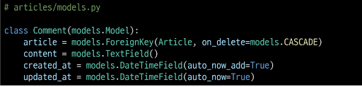

- Migration 및 fixtures 데이터 로드

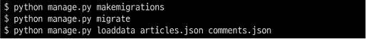

### URL 및 HTTP request method 구성

## GET method

### GET - List

- 댓글 목록 조회를 위한 CommentSerializer 정의

- url 작성

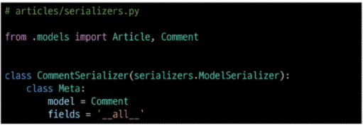

- view 함수 작성

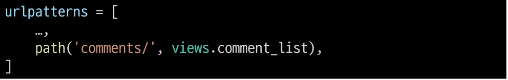

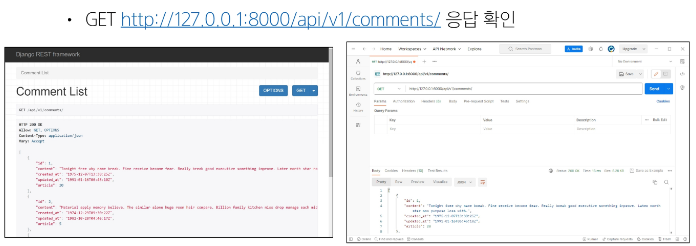

### GET - Detail

- 단일 댓글 조회를 위한 url 및 view 함수 작성

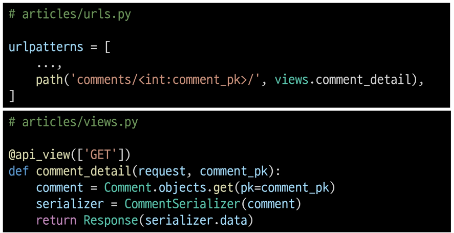

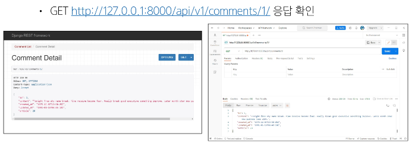

## POST method 

### POST

- 단일 댓글 생성을 위한 url 및 view 함수 작성

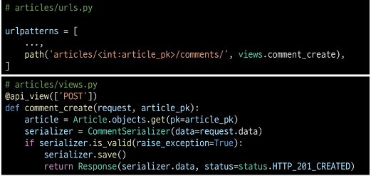

- serializer 인스턴스의 save() 메서드는 특정 Serializer 인스턴스를 저장하는 과정에서 추가 데이터를 받을 수 있음

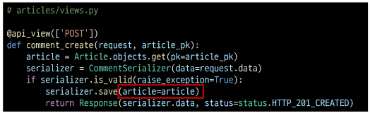

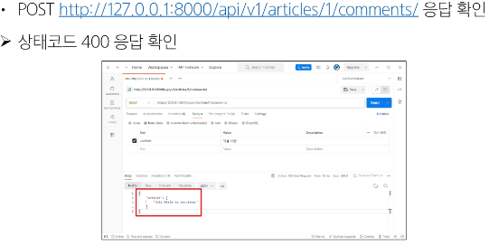

- CommentSerializer에서 외래 키에 해당하는 article field 또한 사용자로부터 입력 받도록 설정되어 있기 때문에 서버 측에서는 누락되었다고 판단한 것

- 유효성 검사 목록에서 제외 필요

- article field를 읽기 전용 필드로 설정하기

- 데이터를 전송 받은 시점에 "유효성 검사에서 제외시키고, 데이터 조회 시에는 출력" 하는 필드

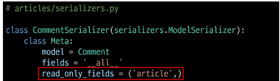

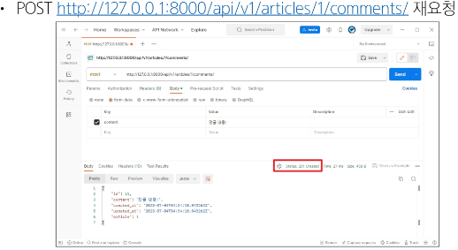

## 읽기 전용 필드

- 클라이언트가 데이터 생성 또는 수정 요청을 보낼 때 해당 필드에 값을 제공하거나 변경할 수 없으며, 서버가 응답 시에만 값을 표시하는 필드

### 읽기 전용 필드 사용 목적

- 클라이언트 측에서 직접 수정하면 안 되는 경우

- 서버 로직에 의해 자동 생성 및 관리되는 값 활용

- 입력은 받지 않지만 정보를 제공해야 하는 경우

- 새로운 필드 값(추가 계산, 가공)을 만들어 제공해야 하는 경우

### 읽기 전용 필드 특징 및 주의사항

- 유효성 검사에서 제외됨
  - 읽기 전용 필드는 클라이언트가 보내는 요청 데이터에서 고려되지 않으므로, 유효성 검사 대상에서 제외됨
  - 즉, 클라이언트가 해당 필드에 값을 넣어도 무시되며 검증 오류를 일으키지 않음

- 생성 및 수정 요청 모두에서 적용 가능
  - 읽기 전용 필드라 해서 생성(POST) 단계에서만 무의미한 것은 아님
  - 수정(PUT) 요청에서도 해당 필드는 여전히 클라이언트 입력을 받지 않고, 응답 시에만 노출됨

### 읽기 전용 필드 정리

- 서버가 관리하거 계산하는 값, 클라이언트가 변경할 수 없어야 하는 값, 또는 단순히 조회 목적으로 제공해야 하는 값을 나타내는 데 유용

- 이를 통해 API 응답 구조를 명확히 하고, 데이터 무결성을 유지하며, 불필요한 클라이언트 입력 처리를 방지

## DELETE & PUT method

### DELETE & PUT

- 단일 댓글 삭제 및 수정을 위한 view 함수 작성

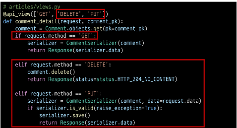

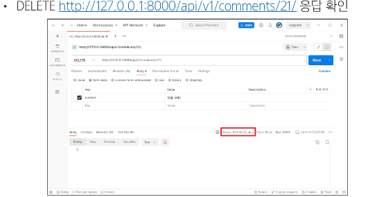

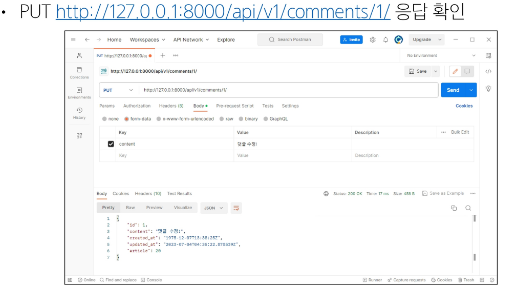

## 응답 데이터 재구성

### 댓글 조회 시 게시글 출력 내역 변경

- 댓글 조회 시 게시글 번호만 제공해주는 것이 아닌 '게시글의 제목'까지 제공하기

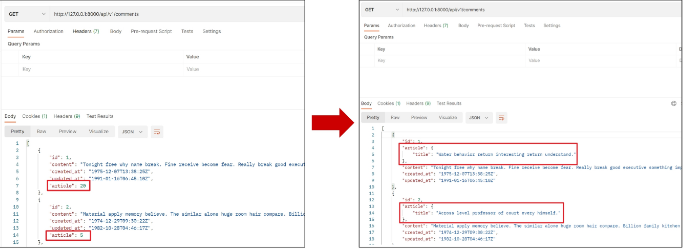

- 필요한 데이터를 만들기 위한 Serializer는 내부에서 추가 선언이 가능

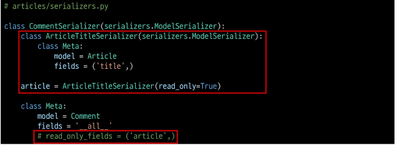

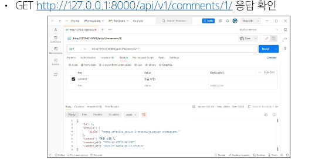

## 읽기 전용 필드 주의사항

- 특정 필드를 override 혹은 추가한 경우 read_only_fields는 동작하지 않음

- > 이런 경우 새로운 필드에 read_only 키워드 인자로 작성해야 함

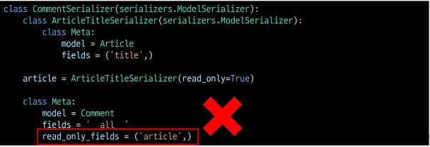

### read_only_fields 속성과 read_only 인자

- read_only_fields
  - 기존 외래 키 필드 값을 그대로 응답 데이터에 제공하기 위해 지정하는 경우

- read_only
  - 기존 외래 키 필드 값의 결과를 다른 값으로 덮어쓰는 경우
  - 새로운 응답 데이터 값을 제공하는 경우

# 역참조 데이터 구성

### article -> Comment 간 역참조 관계를 활용한 JSON 데이터 재구성

- 아래 2가지 사항에 대한 데이터 재구성하기
  1. 단일 게시글 조회 시 해당 게시글에 작성된 댓글 목록도 함께 붙여서 응답
  2. 단일 게시글 조회 시 해당 게시글에 작성된 댓글 개수도 함께 붙여서 응답

## 단일 게시글 + 댓글 목록

1. 단일 게시글 + 댓글 목록

- Nested relationships (역참조 매니저 활용)
  - 모델 관계 상으로 참조하는 대상은 참조되는 대상의 표현에 포함되거나 중첩될 수 있음
  - 이러한 중첩된 관계는 serializers를 필드로 사용하여 표현 가능

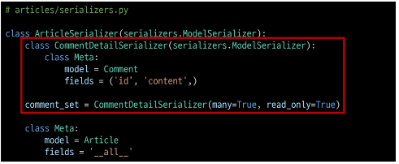

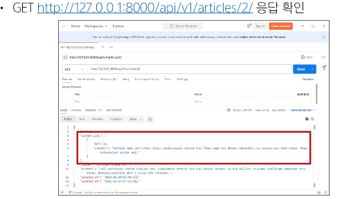

## 단일 게시글 + 댓글 개수

### View 로직 개선: annotate 사용

- View에서 Article 객체를 조회할 때 annotate를 활용해 num_of_comments 필드를 추가
  - annotate는 Django ORM 함수로, SQL의 집계 함수를 활용하여 쿼리 단계에서 데이터 가공을 수행

- 다음과 같이 댓글 수를 세어 num_of_comments라는 필드를 추가

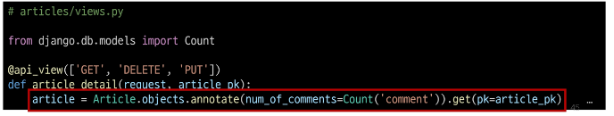

- 이제 serializer.data를 반환하면, 해당 article 객체에는 num_of_comments라는 "주석(annotate) 필드"가 포함되어 있음

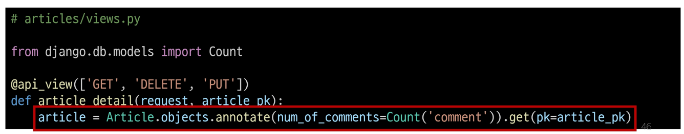

### Serializer 개선 : SerializerMethodField 사용

- SerializerMethodField는 읽기 전용 필드를 커스터마이징 하는데 사용

- 이 필드를 선언한 뒤 get_<필드명> 메서드를 정의하면, 해당 메서드의 반환 값이 직렬화 결과에 포함됨

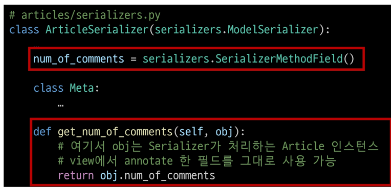

- 이제 serializer.data를 호출할 때, get_num_of_comments 메서드가 실행되어 num_of_comments 값이 자동으로 포함됨

- 추가적으로 view 에서 data를 딕셔너리로 변환하거나 수정할 필요 없이, serializer.data를 바로 반환해도 최종 JSON 응답에 num_of_comments 값이 반영됨

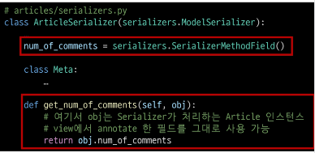

### 댓글 개수 데이터 응답 확인

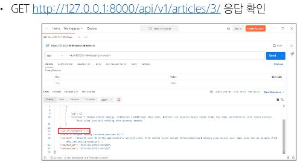

## SerializerMethodField

### SerializerMethodField란

- DRF에서 제공하는 읽기 전용 필드

- Serializer에서 추가적인 데이터 가공을 하고 싶을 때 사용
  - 예: 특정 필드 값을 조합해 새로운 문자열 필드를 만들거나, 부가적인 계산(비율, 합계, 평균)을 하는 경우 등

### SerializerMethodField 동작 원리

- SerializerMethodField를 Serializer 클래스 내에서 필드로 선언하면, DEF는 get_<필드명>이라는 이름을 가진 메서드를 자동으로 찾음

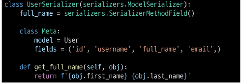

- 예를 들어, full_name = serializers.SerializerMethodField()라고 선언하면, DRF는 get_full_name(self, obj) 메서드를 찾아 해당 값을 직렬화 결과에 넣어 줌

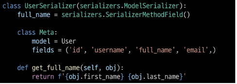

- obj는 현재 직렬화 중인 모델 인스턴스이며, 이 메서드에서 obj의 속성이나 annotate된 필드를 활용해 새 값을 만들 수 있음

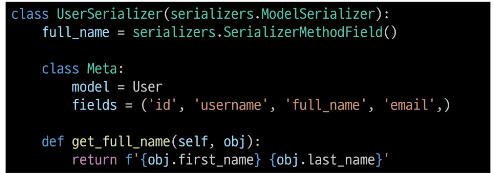

### SerializerMethodField 주의사항

- 읽기 전용으로, 생성(POST), 수정(PUT) 요청 시에는 사용되지 않음

- get_ 메서드는 반드시 (self, obj) 형태로 정의해야 하며, obj는 현재 직렬화 중인 모델 인스턴스를 의미

### SerializerMethodField 사용 목적

- 유연성
  - 다양한 계산 로직을 손쉽게 추가 기능

- 가독성
  - 데이터 변환 과정을 Serializer 내부 메서드로 명확히 분히

- 유지보수성
  - view나 model에 비해 Serializer 측 로직 변경이 용이

- 일관성
  - view에서 별도로 data 수정 없이도 직렬화 결과를 제어

# API 문서화

## 개요

### OpenAPI Specification(OAS)

- RESTful API를 설명하고 시각화하는 표준화된 방법

- > API에 대한 세부사항을 기술할 수 있는 공식 표준

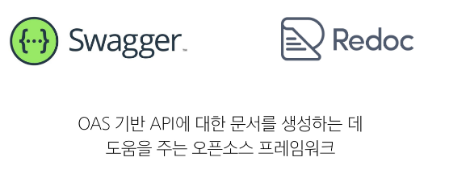

## 문서화 활용

### drf-sepctacular 라이브러리

- DRF 위한 OpenAPI 3.0 구조 생성을 도와주는 라이브러리

- 설치 및 등록

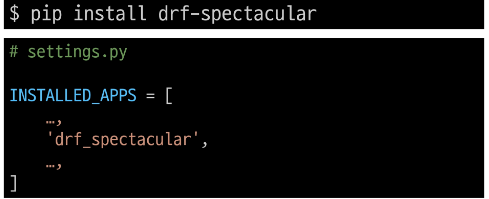

- 관련 설정 코드 입력 (OpenAPI 구조 자동 생성 코드)

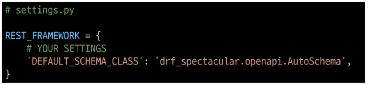

- swagger, redoc 페이지 제공을 위한 url 작성

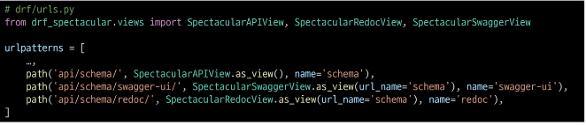

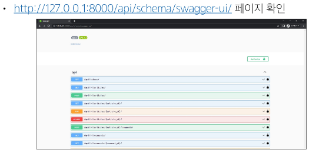

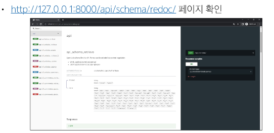

### "설계 우선" 접근법

- OAS의 핵심 이점

- API를 먼저 설계하고 명세를 작성한 후, 이를 기반으로 코드를 구현하는 방식

- API의 일관성을 유지하고, API 사용자는 더 쉽게 API를 이해하고 사용할 수 있음

- 또한, OAS를 사용하면, API가 어떻게 작동하는지를 시각적으로 보여주는 문서를 생성할 수 있으며, 이는 API를 이해하고 테스트하는 데 매우 유용

- > 이런 목적으로 사용되는 도구가 Swagger-UI 또는 ReDoc

# <참고>

## 올바르게 404 응답하기

### Django shortcuts functions

- render(), redirect(), get_object_or_404(), get_list_or_404()

### get_object_or_404()

- 모델 manager objects에서 get()을 호출하지만, 해당 객체가 없을 땐 기존 DoesNotExist 예외 대신 Http404를 raise 함

### get_object_or_404 적용

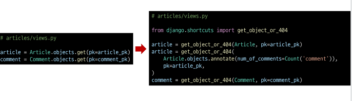

### get_list_or_404()

- 모델 manager objects에서 filter()의 결과를 반환하고, 해당 객체 목록이 없을 땐 Http404를 raise 함

### get_list_or_404() 적용

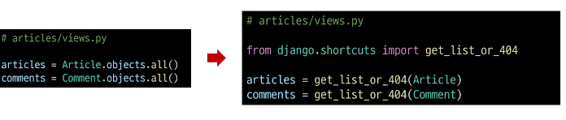

### 적용 전/후 비교

- 존재하지 않는 게시글 조회 시 이전에는 상태 코드 500을 응답했지만 현재는 404를 응답

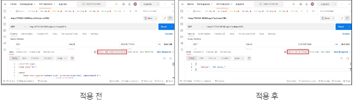

### 왜 사용해야 할까?

- 클라이언트에게 "서버에 오류가 발생하여 요청을 수행할 수 없다(500)"라는 원인이 정확하지 않은 에러를 제공하기 보다는, 적절한 예외 처리를 통해 클라이언트에게 보다 정확한 에러 현황을 전달하는 것도 매우 중요한 개발 요소 중 하나이기 때문

## View와 Serializer의 역할

### View와 Serializer

- DRF에서는 비즈니스 로직(데이터 가공, annotate, 필터링)을 view나 queryset 로직에서 처리하고, serializer는 그 결과물을 직렬화하는 역할에 집중하는 것이 일반적인 권장사항

- 복잡한 query나 로직은 View 함수에서 진행
  - 여러 모델을 조인하거나 복잡한 집계가 필요한 경우 View 함수에서 처리
  - 필요한 경우 View 함수에서 select_related()나 prefeth_related()를 사용하여 query를 최적화

## DRF 학습 이유

### 왜 DRF를 배웠을까?

- 백엔드와 프론트엔드의 분리 경험
  - 기존 Django 템플릿 기반의 서버 렌더링 방식을 벗어나, 백엔드(데이터-로직)와 프론트엔드(UI)를 명확히 분리하는 패턴을 간접적으로 체험

- 표준화된 API 구축 역량 확보
  - DRF를 통해 RESTful API를 손쉽게 만들고 관리하는 방법을 학습했는데, 이는 다양한 클라이언트(웹, 모바일 앱, 외부 서비스)와 연동하는 데 필수적인 능력

- 프론트엔드 기술과의 연결 고리
  - 앞으로 학습할 Javascript 및 Vue는 주로 API를 통해 데이터를 받아와 화면을 구성함
  - DRF로 구착한 일관된 API는 Vue 등 프론트엔드 프레임워크와 매끄럽게 호환됨